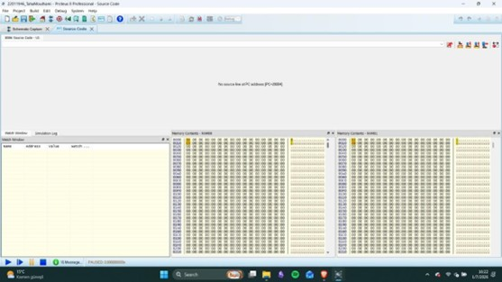

# MSAD Homework 2 – 8086 Memory Mapping & Address Decoding


## Screenshots

### Circuit Schematic (Proteus)


### RAM Output – Simulation Result


---

## Overview

This project implements a full 8086 memory interfacing and address decoding circuit in **Proteus**, featuring a 64 KB ROM block and a 64 KB RAM block mapped to specific physical addresses. The design uses 74LS138 decoders, 74273 D flip-flops, 27C128 EPROMs, and 62256 SRAMs with even/odd bank separation.


## Memory Map

| Block | Start Address | End Address | Size | Components |
|-------|--------------|-------------|------|------------|
| ROM   | `20000H`     | `2FFFFH`    | 64 KB | 4 × 27C128 (16 KB each) |
| RAM   | `60000H`     | `6FFFFH`    | 64 KB | 2 × 62256 (32 KB each) |

### ROM Bank Layout

| Address Range     | Even Bank (A0=0) | Odd Bank (/BHE=0) |
|------------------|-----------------|------------------|
| `20000H–27FFFH`  | ROM00           | ROM01            |
| `28000H–2FFFFH`  | ROM10           | ROM11            |

### RAM Bank Layout

| Address Range     | Even Bank (A0=0) | Odd Bank (/BHE=0) |
|------------------|-----------------|------------------|
| `60000H–6FFFFH`  | RAM00           | RAM01            |


## Address Decoding Logic

### Block Selection – 74LS138 #1 (High Address Bits)

| A19 | A18 | A17 | Selected Block |
|-----|-----|-----|---------------|
| 0   | 0   | 1   | ROM Block     |
| 0   | 1   | 1   | RAM Block     |

### ROM Internal Selection – 74LS138 #2

| A16 | A15 | A14 | ROM Section |
|-----|-----|-----|-------------|
| 0   | 0   | 0   | ROM Low (`ROM0x`) |
| 0   | 1   | 0   | ROM High (`ROM1x`) |

### Even / Odd Bank Selection

| Bank      | Condition  |
|-----------|-----------|
| Even Bank | `A0 = 0`  |
| Odd Bank  | `/BHE = 0` |

Chip select signals are generated by combining block select outputs with `A0` / `/BHE` using logic gates.


## ROM Binary Files

The following `.bin` files must be loaded into the corresponding EPROM chips in Proteus:

| File    | Target Chip |
|---------|-------------|
| `00.bin` | ROM00      |
| `01.bin` | ROM01      |
| `10.bin` | ROM10      |
| `11.bin` | ROM11      |


## Firmware / Test Code

The ROM contains two **FAR subroutines**:

- **Subroutine 1** at segment `2000H:0000H` — writes specific values to low RAM addresses
- **Subroutine 2** at segment `2800H:0002H` — writes additional data to RAM

The main program runs an infinite loop that continuously calls both subroutines:

```asm
ENDLESS:
    CALL FAR PTR SUB1   ; at 2000H:0000H
    CALL FAR PTR SUB2   ; at 2800H:0002H
    JMP ENDLESS
```

To verify correctness, pause the Proteus simulation and inspect the **RAM00** and **RAM01** memory contents windows for the written values.


## How to Run

1. Open the `.pdsprj` file in **Proteus 8 Professional**.
2. Load the binary files into the respective ROM chips (right-click each chip → Edit Properties → Program File).
3. Run the simulation.
4. Pause the simulation and open **Memory Contents – RAM00** and **Memory Contents – RAM01** to verify data was written successfully.


## Naming Convention

- `RxMx0` → Even bank chips (e.g., ROM00, ROM10, RAM00) — mapped to even addresses (`A0 = 0`)
- `RxMx1` → Odd bank chips (e.g., ROM01, ROM11, RAM01) — mapped to odd addresses (`/BHE = 0`)
- `ROM0x` → Low ROM block (`20000H–27FFFH`)
- `ROM1x` → High ROM block (`28000H–2FFFFH`)
