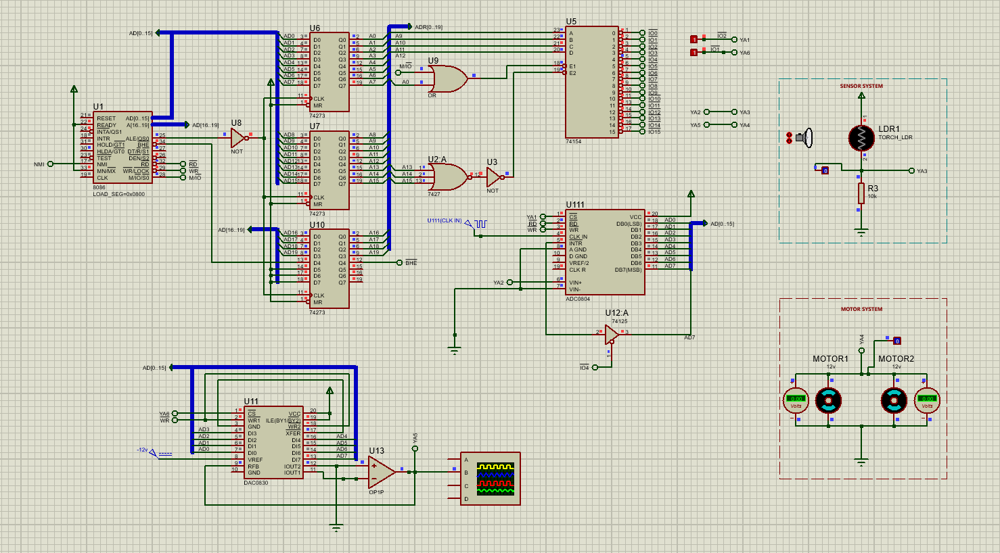
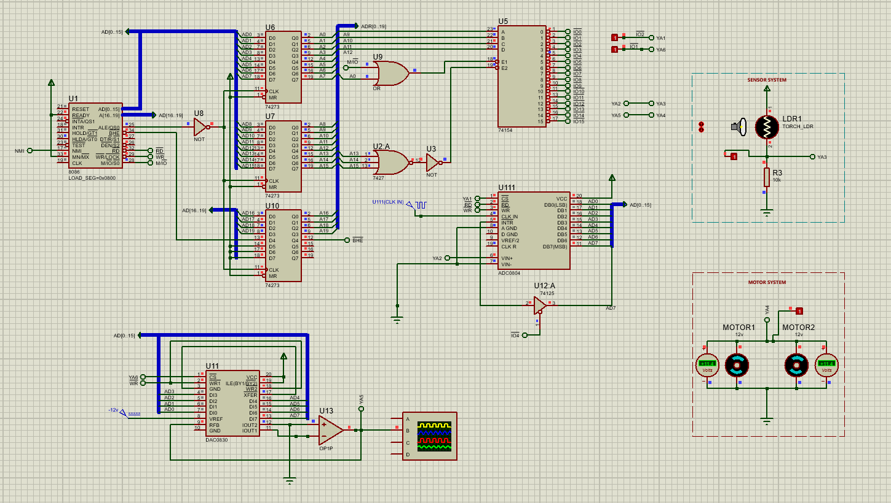

# Closed-Loop Control: Sensor-Driven Motor Speed Regulation

## Overview
This project implements a real-time control system that bridges an analog sensor input with an analog actuator output using an 8086 microprocessor. The system regulates the speed of a dual-motor robot based on light intensity detected by a Light Dependent Resistor (LDR).

## Hardware Architecture
The system utilizes a sophisticated I/O mapping strategy to integrate multiple analog components:
* **Microprocessor**: 8086 CPU.
* **Analog Input**: ADC0804 converter interfaced with an LDR sensor system.
* **Analog Output**: DAC0830 converter driving a dual 12V DC motor system.
* **Status Monitoring**: A tri-state buffer is used to map the ADC's \INTR signal to the system data bus.

## Device Mapping and Addressing
The peripherals are mapped to the following isolated I/O addresses:
* **DAC0830**: 200H (Analog output control).
* **ADC0804**: 400H (Digital data reading).
* **Status Port**: 800H (Monitoring the \INTR line on bit D7).

## Technical Implementation Details

### 1. Hardware-Level Synchronization (Polling)
To ensure reliable data processing, the program avoids static software delays. Instead, it implements a hardware-aware polling loop:
* The program monitors the `\INTR` line of the ADC0804 via address `800H`.
* The logic remains in a tight loop, checking the `D7` bit until it transitions to `0`, signaling that the analog-to-digital conversion is complete.
* This method ensures that the processor only reads data when the ADC has a stable digital value ready.

### 2. Proportional Control Logic
The software creates a direct proportional relationship between light proximity and motor speed:
* **Sensor Input**: As a light source (torch) approaches the LDR, the analog voltage changes, resulting in a higher digital value from the ADC.
* **Actuator Output**: The digital value is processed and sent to the DAC0830, which converts it back into an analog voltage to drive the motors.
* **Behavior**: At maximum light proximity, the motors operate at full speed. As the light source recedes, the motors decelerate proportionally until they come to a complete stop at the furthest distance.

## Simulation and Testing
The project was verified using Proteus, where motor behavior was monitored via virtual voltmeters and the LDR response was tested using a virtual torch component. 

## Source Files
* `motor_control.asm`: Contains the I/O initialization, ADC status polling loop, and proportional scaling logic.
* `robot_control.pdsprj`: Complete Proteus schematic including the sensor voltage divider and motor driver circuit.
