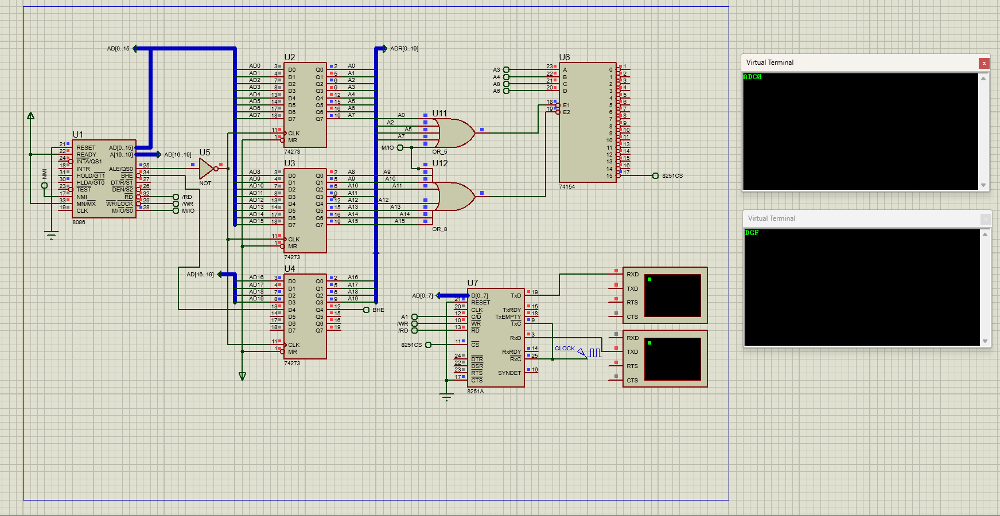

# Serial Communication and USART Interfacing (8251)

## Overview
This project implements a secure serial transmitter-receiver system using the 8251 USART (Universal Synchronous Asynchronous Receiver Transmitter). The system facilitates communication between two Virtual Terminals, incorporating real-time data filtering, buffer management, and a Caesar cipher encryption layer.

## Hardware Configuration
The system is built on an isolated I/O architecture with the following components[cite: 9]:
* **Microprocessor**: 8086 CPU[cite: 9].
* **Communication Controller**: 8251 USART[cite: 9].
* **Address Decoding**: 74154 Demultiplexer and 74273 D-Type Flip-Flops are utilized to map the device to the isolated I/O space[cite: 9].
* **I/O Peripherals**: Dual Virtual Terminals representing the transmitter and receiver stations[cite: 9].

## Technical Specifications

### 1. Isolated I/O Addressing
The address decoding logic is designed to activate the 8251 USART using the $M/\overline{IO}$ signal[cite: 9]:
* **Base Address**: $0158H$[cite: 9].
* **Addressing Scheme**: Uses consecutive even addresses for data and control registers[cite: 9].
* **Decoder**: The 74154 demultiplexer handles the device selection based on the 8086 address bus[cite: 9].

### 2. Communication Parameters
* **Baud Rate**: $9600$ Hz ($9.6$ kHz)[cite: 9].
* **Clocking**: The $RxC$ (Receive Clock) and $TxC$ (Transmit Clock) pins are synchronized to the required baud rate for stable transmission[cite: 9].

### 3. Software Processing Pipeline
The software follows a strictly defined protocol for data handling[cite: 9]:
* **Input Filtering**: Only uppercase alphabetic characters (A-Z) are accepted. Numbers, symbols, and lowercase letters are discarded[cite: 9].
* **Encryption**: Valid characters are encrypted using a Caesar cipher with a shift of $+3$ (e.g., 'A' becomes 'D') before transmission[cite: 9].
* **Buffer Management**: The system maintains a buffer of incoming characters. Upon receiving the termination character ('0'), the three most recent valid characters are processed and displayed[cite: 9].
* **Transmission**: Processed characters are sent to the second Virtual Terminal in the original order of entry[cite: 9].

## Simulation Details
The implementation includes a specific fix for simulation environments:
* **Bug Mitigation**: Immediately following an `IN AL, DATA_PORT` instruction, a `SHR AL, 1` operation is performed to ensure compatibility with the Proteus simulation engine[cite: 9].
* **Real-time Monitoring**: The logic is verified through interactive Virtual Terminals, ensuring the filtered and encrypted output matches expected scenarios[cite: 9].

## Source Files
* `usart_comm.asm`: Assembly source containing the USART initialization, filtering loop, and encryption logic[cite: 9].
* `serial_link.pdsprj`: Complete Proteus schematic including the address decoding circuit and peripheral connections[cite: 9].
